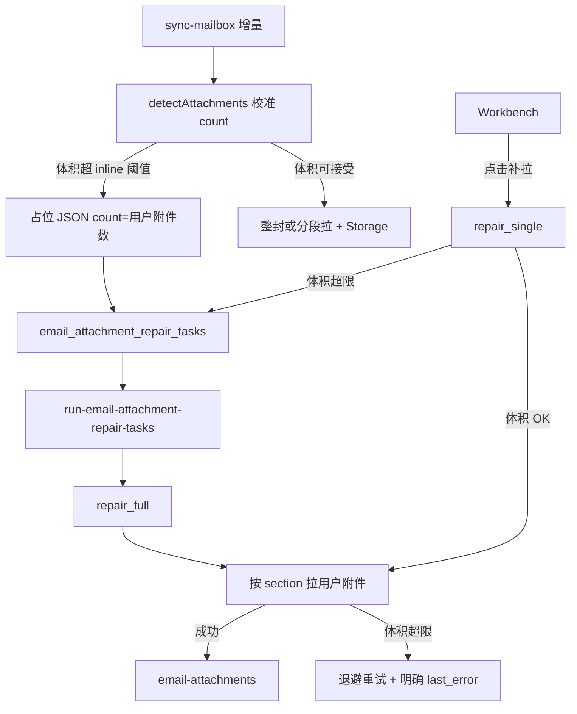

# 入站附件：数量对齐 + 小邮件补拉门闸修复 — 设计规格

**日期**：2026-07-14  
**状态**：已批准（2026-07-14）  
**范围**：`mail-guide-ai-main` 入站附件检测、占位展示、交互/后台补拉（不改出站附件）

---

## 1. 背景与问题

### 1.1 现象（已确认）

- 工作台显示「约 6 个附件，待补拉」，官方 Gmail 仅 **2** 个附属品（约 1.3MB 图）。
- 真实体积不大（几 MB 内），仍写「邮件体积较大」并进入后台队列，第 N 次尝试仍加载不出。

### 1.2 根因（代码）

| # | 问题 | 位置 |
|---|------|------|
| 1 | `detectAttachments` 用 `"attachment"` / `NAME=` / `FILENAME=` 启发式计数，把内嵌图等算进 `count` | `sync-mailbox/index.ts` |
| 2 | `placeholderSuggestsLargeMail`：`count >= 3` 即视为大邮件 | 同上 |
| 3 | 交互补拉遇「大占位」**不连 IMAP**，只重新入队 | `repairEmailById` |
| 4 | `parseAttachmentPartSections` 把多数非 text 叶子（含 `inline`）当附件拉 | `imap-bodystructure.ts` |
| 5 | 自动同步内联上限约 1.5MB，有附件时再 ×0.6，小邮件易被标「体积较大」 | `shouldDeferHeavyInlineFetch` |
| 6 | 正文已有、附件补拉失败时 `repair_full` 常返回 `repaired: 0`，任务空转重试 | `repairEmailByIdFull` + `run-email-attachment-repair-tasks` |

### 1.3 目标

1. **数量**：工作台「待补拉」数量与官方「用户附件」对齐（`disposition=attachment`，不含纯内嵌图）。
2. **小邮件**：几 MB 内必须走 IMAP 分段补拉，不能仅因 `count≥3` 或虚高 count 永久排队。
3. **可观测**：后台失败写清原因，避免「第 N 次尝试」却无实质 FETCH。

### 1.4 非目标

- 不引入旁路长时 Worker / Exchange Graph。
- 不改出站附件、不改 Dify 附件语义（仍只吃元数据）。
- 不保证 25MB+ 超大附件同步成功（仍走队列 + 体积上限）。

---

## 2. 产品规则

### 2.1 「用户附件」定义（与 Gmail 对齐）

计为用户附件当且仅当 BODYSTRUCTURE / MIME 满足其一：

- `Content-Disposition: attachment`，或
- 有明确 `filename`/`name` 且 **不是** 仅用于正文 `cid:` 引用的内嵌图（`disposition=inline` + `content-id` 且正文引用 → 内嵌图）

展示：

- **文件附件区**：用户附件（含占位待补拉）。
- **内嵌图**：继续走现有正文 `cid:` / `partitionWorkbenchAttachments` 逻辑；占位文案写「约 N 个」时 **N = 用户附件数**，不再把内嵌图计入 N。

### 2.2 「是否大邮件」定义

仅根据 **RFC822.SIZE**（及现有 `MAIL_SYNC_*_MAX_BYTES`）判断，**禁止**用占位 `count` 推断「大」。

| 场景 | 行为 |
|------|------|
| `rfc822Size` ≤ 交互/批量附件拉取上限 | 立即分段 IMAP 补拉 |
| `rfc822Size` > 上限 | 入后台队列，文案可保留「体积较大」 |
| 仅 `count` 偏大、体积不大 | **不得**跳过 IMAP |

### 2.3 文案

- 占位：`邮箱中约有 N 个附件…` → N 用校准后的用户附件数。
- 仅当真正因体积延后时，才使用「邮件体积较大…」类文案。
- 因启发式误判延后的历史邮件，补拉成功后自然消失；不做批量 DB 回填。

---

## 3. 技术方案

### 3.1 组件与职责

```
imap-bodystructure.ts
  ├─ parseAttachmentPartSections()     // 改为可区分 user vs inline
  └─ countUserAttachments(metaRaw)     // 新增：供 detect / 占位 count

sync-mailbox/index.ts
  ├─ detectAttachments()               // count 改用 BODYSTRUCTURE 用户附件数
  ├─ placeholderSuggestsLargeMail()    // 删除 count≥3；仅保留历史文案启发（可选）或整函数降级
  ├─ repairEmailById (interactive)     // 去掉「大占位则只入队」短路
  ├─ repairAttachmentsForRecord()      // deferLarge 只看 rfc822Size
  └─ repairEmailByIdFull()             // 附件失败返回明确 error / queue_reason

run-email-attachment-repair-tasks
  └─ 根据 sync-mailbox 返回的 queue_reason / error 写 last_error（非一律「未返回 repaired」）

Workbench / workbench-attachments
  └─ 展示文案沿用 count；后端校准后前端无需大改（可加单测）
```

### 3.2 `detectAttachments` 校准

- **保留**启发式 `hasAttachment`（避免再出现「误判无附件 → 只拉 TEXT」）。
- **`count`** 改为：优先 `parseAttachmentPartSections` / 新 `countUserAttachments` 的用户附件数；解析失败时回退为 `hasAttachment ? 1 : 0`（不再用 NAME= 正则累加）。

### 3.3 BODYSTRUCTURE 分段拉取

`parseLeafPart` 调整：

- `disposition=attachment` → 用户附件（必拉）。
- `disposition=inline` + image + contentId → **内嵌图**（补拉时仍可拉，用于正文；**不计入**占位 count）。
- 无 disposition、非 text、有 filename → 仍视为用户附件（兼容部分客户端）。
- 无 disposition、无 filename 的 image → 视为内嵌候选，**不计入** count；补拉阶段可按现有「非 text 叶子」策略拉或不拉（实现时选：**小体积仍拉**，避免丢签名图；count 不计）。

交互与后台补拉统一：优先按 section 拉用户附件；内嵌图在同轮有时间预算时一并拉。

### 3.4 门闸修改（核心）

**删除 / 改写：**

```text
placeholderSuggestsLargeMail: maxCount >= 3 → true
```

改为：

- 交互路径：只要 `attachmentsJsonNeedsBinarySync` 且 `rfc822Size ≤ INTERACTIVE/BATCH 上限`，**必须**尝试 `repairAttachmentsForRecord`。
- `repairAttachmentsForRecord.deferLarge`：仅 `rfc822Size > rfc822Limit`。
- 历史 note 含「历史邮件轻量」不再单独阻止补拉（体积门闸已足够）。

### 3.5 同步阶段「体积较大」文案

- `shouldDeferHeavyInlineFetch` 逻辑可保留（保护 Edge 时间片），但：
  - 占位 `count` 用校准值；
  - 入队后后台用 `skipPlaceholderGate` + 仅体积门闸（已有），确保小邮件能被补上。
- 可选小优化（本迭代纳入）：自动同步 `attachRatio` 或默认 `MAIL_SYNC_INCREMENTAL_INLINE_MAX_BYTES_AUTO` 从 1.5MB 提到 **3MB**，减少「假大邮件」入队率。作为环境默认值变更，写进变更说明。

### 3.6 `repairEmailByIdFull` 回传

当正文非空且需要附件时：

| `attStatus` | HTTP/结果字段 |
|-------------|----------------|
| `repaired` | `repaired: 1` |
| `queued_large` | `repaired: 0`, `queued: true`, `queue_reason: rfc822_size_...` |
| `still_missing` / `skip_no_uid` | `repaired: 0`, `error: <明确中文/英文短句>` |
| 抛错 | `repaired: 0`, `error: message` |

**禁止**在附件未修好时返回伪装成成功的 `skipped: true` 且无 `error`。

`run-email-attachment-repair-tasks`：

- `repaired > 0` → resolved  
- `queued: true` 且仍超体积 → 可保持 pending + 退避，但 `last_error` 写体积原因  
- 有 `error` → 按现有 classify + 退避  
- 不再用笼统「补拉结果未返回 repaired」掩盖具体原因  

### 3.7 数据流（修复后）



---

## 4. 错误处理

- IMAP UID 找不到：`skip_no_uid`，任务可终态 failed（沿用现有）。
- 单 part 超 `PART_MAX_BYTES`：跳过该 part，其余继续；若全部跳过 → `still_missing` + note。
- Worker 取消：仍入队/退避，文案区分「超时」与「体积」。
- Storage 上传失败：保留 `download_status=failed` + warning。

---

## 5. 测试计划

### 5.1 单元（Deno）

- BODYSTRUCTURE 样例：mixed + related（2 attachment JPEG + 若干 inline logo）→ `countUserAttachments === 2`，part 列表区分正确。
- `detectAttachments`：同上 meta → `count === 2`，`hasAttachment === true`。
- `placeholderSuggestsLargeMail`（或替代逻辑）：count=6、无体积信息时 **不得** 阻止补拉（测门闸函数）。

### 5.2 前端（Vitest，若有纯函数抽出）

- 占位 `count: 2` 展示「约 2 个」。

### 5.3 手工验收

1. 同步一封 Gmail「2 附属品、各约 1MB」邮件：工作台 N≈2，且最终可预览/下载。  
2. 打开已卡在「约 6 个、第 N 次」的历史邮件：触发补拉或等一轮 cron 后应能修好（体积未超限前提下）。  
3. 真正超大附件（若有）：仍入队，文案为体积原因，不误报成「未返回 repaired」。

---

## 6. 风险与回滚

| 风险 | 缓解 |
|------|------|
| 过严过滤导致漏计真实附件 | 无 disposition 但有 filename 仍计为用户附件 |
| 提高 auto inline 上限增加 Worker 压力 | 默认仅提到 3MB；可用 env 回调 |
| 历史占位 count 仍为 6 | 补拉成功覆盖；失败不影响新逻辑 |

回滚：还原 `detectAttachments` / 门闸 / `repairEmailByIdFull` 三处提交即可。

---

## 7. 实现顺序（供后续 plan）

1. `imap-bodystructure`：用户附件 vs 内嵌分类 + 单测  
2. `detectAttachments` + 去掉 count≥3 门闸  
3. `repairEmailById` / `repairAttachmentsForRecord` / `repairEmailByIdFull` 回传  
4. `run-email-attachment-repair-tasks` 错误透传  
5. 默认 inline 上限微调（可选同 PR）  
6. 手工验收清单

---

## 8. 已确认决策

- 采用 **方案 1**（修判定 + 补拉门闸），不做旁路 Worker。
- 用户附件定义与 Gmail 对齐（见 §2.1）。
- 「是否大邮件」只看 RFC822.SIZE（见 §2.2）。
