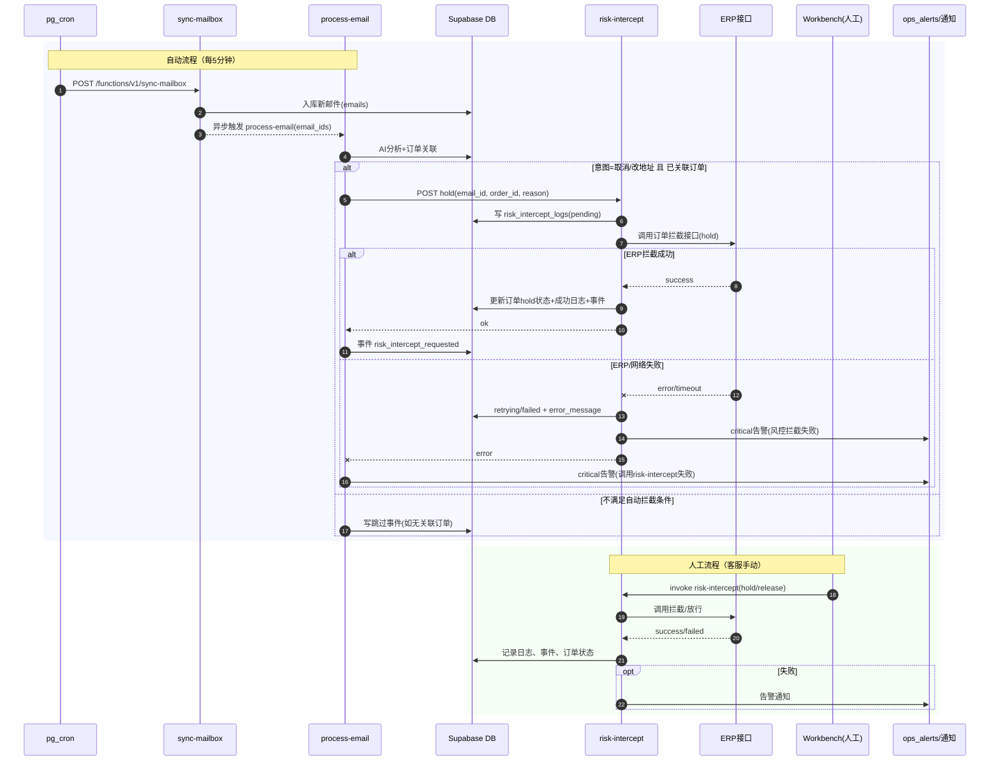
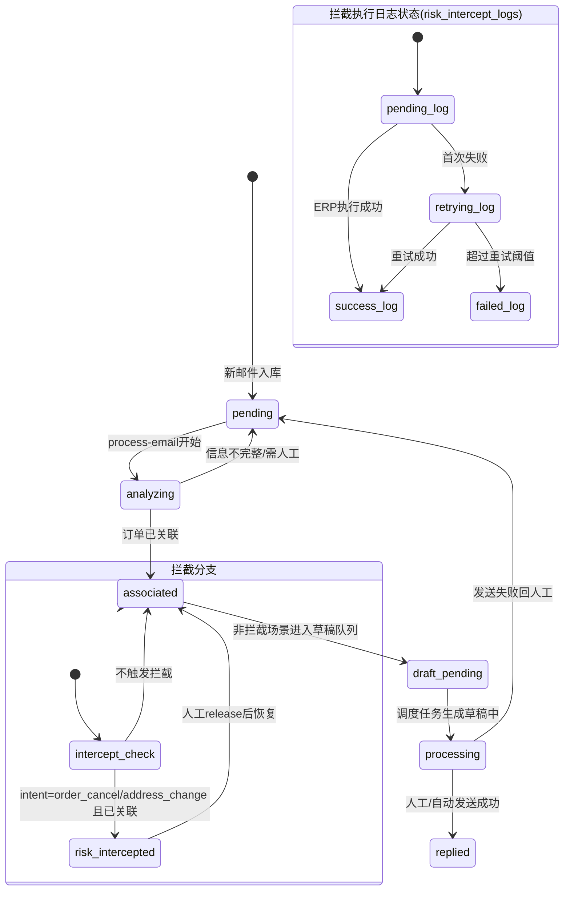

# ERP 订单接口文档（鉴权、查单、拦截）

## 1. 文档信息

- **文档目的**：规范 ERP 侧 OAuth2 取 Token、OMS 订单查询、Java 网关订单拦截的调用方式，统一测试与线上联调口径。
- **鉴权方式**：OAuth2（Password 模式，先取 Token 再调用业务接口）。
- **相关文档**：
  - [`erp-dome.md`](./erp-dome.md)：正式环境联调摘录（OMS 路径、响应外壳、安全说明）。
  - [`erp-api-requirements.md`](./erp-api-requirements.md)：对内目标契约与产品需求。
- **当前范围**：
  - 获取 Token：已确认（测试 / 正式字段差异见 §3.2）。
  - 订单拦截：已确认路径与鉴权；**HTTP Method 为 `POST`**（`orderId` 放在 Query，见 §4）。
  - 订单查询（OMS）：已补充正式路径与请求体，详见 §5 与 `erp-dome.md`。

---

## 2. 环境说明

### 2.1 测试环境

- 鉴权地址：`https://loginserver.chinabestwo.net:4430/connect/token`
- 业务地址（拦截，`POST`）：`http://10.100.1.205:9000/report/website/orders/order-blocking-by-order-ids`

### 2.2 线上环境

- 鉴权地址：`https://loginserver.bestwo.net:9443/connect/token`
- Java 业务网关（订单拦截等）：`https://gatewayjava.bestwo.net:9443`
- OMS 订单查询：`https://omsapi.bestwo.net:9443`（路径见 §5）

> 说明：线上 Token 须使用企业分配的个人或服务账号，**勿在仓库中保存明文密码或 JWT**。正式联调示例与响应外壳见 [`erp-dome.md`](./erp-dome.md)。

---

## 3. 鉴权接口（获取 Token）

### 3.1 请求信息

- URL：`/connect/token`
- Method：`POST`
- Content-Type：`application/x-www-form-urlencoded`

### 3.2 请求参数

| 参数名 | 类型 | 必填 | 说明 |
| --- | --- | --- | --- |
| `username` | string | 是 | 登录账号 |
| `password` / `pw` | string | 是 | 密码；**字段名随环境变化**（见下表） |
| `client_id` | string | 是 | 客户端标识 |
| `grant_type` | string | 是 | 固定 `password` |

**环境与字段差异（重要）**

| 环境 | 密码表单字段名 | `client_id` |
| --- | --- | --- |
| 测试（当前联调口径） | `pw` | `Java` |
| 正式 | `password` | `ERP` |

### 3.3 请求示例（测试环境）

凭据由 ERP 侧提供，通过环境变量注入，**勿写入 Git**。

```bash
curl --location --request POST 'https://loginserver.chinabestwo.net:4430/connect/token' \
  --header 'Content-Type: application/x-www-form-urlencoded' \
  --data-urlencode "username=${ERP_TEST_USERNAME}" \
  --data-urlencode "pw=${ERP_TEST_PASSWORD}" \
  --data-urlencode "client_id=${ERP_TEST_CLIENT_ID:-Java}" \
  --data-urlencode 'grant_type=password'
```

### 3.4 正式环境获取 Token

- **鉴权完整 URL**：`https://loginserver.bestwo.net:9443/connect/token`
- **Method**：`POST`
- **Content-Type**：`application/x-www-form-urlencoded`
- **表单字段（正式口径）**：`username`、**`password`**（正式为字段名 `password`，不是测试环境的 `pw`）、`grant_type=password`、**`client_id=ERP`**

**curl 示例（凭据请用环境变量或本地私密配置注入，勿提交到 Git）**

```bash
curl --location --request POST 'https://loginserver.bestwo.net:9443/connect/token' \
  --header 'Content-Type: application/x-www-form-urlencoded' \
  --data-urlencode "username=${ERP_USERNAME}" \
  --data-urlencode "password=${ERP_PASSWORD}" \
  --data-urlencode 'grant_type=password' \
  --data-urlencode "client_id=${ERP_CLIENT_ID:-ERP}"
```

**Windows（PowerShell）**：使用 `scripts/erp-fetch-prod-token.ps1`（正式默认 `password` + `client_id=ERP`）。示例：

```powershell
$env:ERP_USERNAME = '你的登录名'
$env:ERP_PASSWORD = '你的密码'
$env:ERP_CLIENT_ID = 'ERP'   # 可选，省略时脚本默认 ERP
.\scripts\erp-fetch-prod-token.ps1
```

### 3.5 响应示例

```json
{
  "access_token": "eyJ...",
  "token_type": "Bearer",
  "expires_in": 3600
}
```

正式环境可能出现 **`expires_in` 较大**（如 43200）及 **`refresh_token`**，以 IdP 实际返回为准。日志中**不要**打印完整 `access_token`。

> 失败时可能返回 OAuth2 标准错误 JSON（如 `error`、`error_description`），请以 HTTP 状态码与响应体为准排查账号、`client_id` 或网络 TLS。

---

## 4. 订单拦截接口

> **Method 约定**：鉴权（§3）、OMS 查单（§5）与本节订单拦截均为 **`POST`**。拦截接口的 `orderId` 放在 **Query**，请求体可为空。

### 4.1 请求信息

- **Path**：`/report/website/orders/order-blocking-by-order-ids`
- **Method**：`POST`（测试与线上一致）
- **鉴权头**：`Authorization: Bearer {access_token}`

### 4.2 Query 参数

| 参数名 | 类型 | 必填 | 示例值 | 说明 |
| --- | --- | --- | --- | --- |
| `orderId` | string | 是 | `SEDETA58827` | 需拦截的 ERP 订单号 |

### 4.3 请求示例（测试环境）

```bash
ACCESS_TOKEN='从鉴权接口获取'
ORDER_ID='SEDETA58827'

curl --location --request POST \
  "http://10.100.1.205:9000/report/website/orders/order-blocking-by-order-ids?orderId=${ORDER_ID}" \
  --header "Authorization: Bearer ${ACCESS_TOKEN}"
```

### 4.4 请求示例（线上环境）

```bash
ACCESS_TOKEN='从鉴权接口获取'
ORDER_ID='SEDETA58827'

curl --location --request POST \
  "https://gatewayjava.bestwo.net:9443/report/website/orders/order-blocking-by-order-ids?orderId=${ORDER_ID}" \
  --header "Authorization: Bearer ${ACCESS_TOKEN}"
```

### 4.5 响应外壳（Java 网关 / OMS 常见形态）

业务成功或「无单」等常在外层 `code: 200` 下仍返回 JSON；**业务是否成功**请看 `data` 内字段或 `businessCode`。排错建议携带并落库 `traceId`。

```json
{
  "success": true,
  "code": 200,
  "timestamp": 1778337329800,
  "businessCode": 2000000000,
  "traceId": "8afdf0bcb6fb4c8087e3575547499b59",
  "data": {
    "orderId": "123456",
    "success": false,
    "message": "未查询到订单信息"
  }
}
```

> 拦截成功时的 `message`、`businessCode` 枚举以 ERP 最新说明为准；上表仅为结构示例（与查单响应外壳类似）。

---

## 5. 订单查询（OMS，正式环境）

### 5.1 请求信息

- **Method**：`POST`
- **Path**：`/AukeysOrder/OrderInfo/QueryOrderInfo`
- **完整 URL**：`https://omsapi.bestwo.net:9443/AukeysOrder/OrderInfo/QueryOrderInfo`
- **Headers**：`Content-Type: application/json`、`Authorization: Bearer {access_token}`

### 5.2 Body（JSON）

| 字段 | 类型 | 必填 | 说明 |
| --- | --- | --- | --- |
| `email` | string | 视业务 | 客户/站点邮箱等 |
| `ebayOrderId` | string | 否 | 可为空字符串 `""` |

### 5.3 curl 示例

```bash
ACCESS_TOKEN='从鉴权接口获取'

curl --location --request POST \
  'https://omsapi.bestwo.net:9443/AukeysOrder/OrderInfo/QueryOrderInfo' \
  --header 'Content-Type: application/json' \
  --header "Authorization: Bearer ${ACCESS_TOKEN}" \
  --data-raw '{
    "email": "buyer@example.com",
    "ebayOrderId": ""
  }'
```

### 5.4 响应说明

外层与 §4.5 类似；`data` 内可能含 `orderId`、`success`、`message`（如「未查询到订单信息」）。调用方须区分 **HTTP / 外层 `code`** 与 **`data` 内业务结果**，避免将「无单」当作网络故障反复重试。

更完整的示例与注意事项见 [`erp-dome.md`](./erp-dome.md) §4。

---

## 6. 联调流程

1. 调用鉴权接口获取 `access_token`。
2. 在业务请求头中设置 `Authorization: Bearer {access_token}`。
3. **查单**：`POST` OMS `QueryOrderInfo`，解析外层与 `data` 业务字段。
4. **拦截**：`POST` 调用网关路径，Query 传入 `orderId`，解析响应与 `traceId`。
5. 校验 HTTP 状态码、外层 `code` / `businessCode` 与 `data` 内信息，确认业务结果。

---

## 7. 待补充信息

- `businessCode`、`data.message` 完整枚举与「拦截成功」判定规则。
- OMS 查单在 **测试环境** 的 Base URL 与示例（若与正式路径不一致）。
- 是否支持批量拦截（如 `orderIds` 多值传参规则）。

---

## 8. 系统时序图（自动拦截 + 人工拦截）



---

## 9. 状态机图（邮件处理与拦截）


