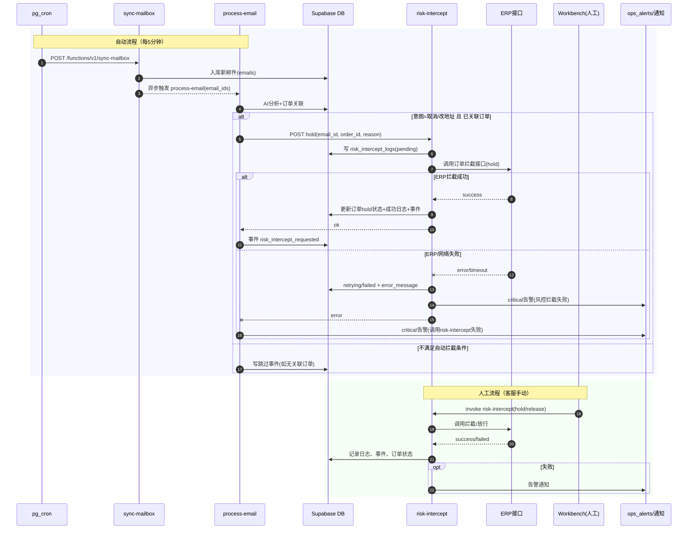
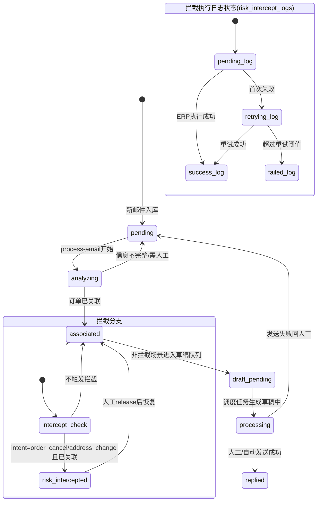

# ERP 订单接口文档（订单拦截）

## 1. 文档信息

- 文档目的：规范 ERP 订单拦截接口的调用方式，统一测试与线上联调口径。
- 鉴权方式：OAuth2（Password 模式，先取 Token 再调用业务接口）。
- 当前范围：
  - 获取 Token：已确认
  - 订单拦截：已确认
  - 订单查询：待补充

---

## 2. 环境说明

### 2.1 测试环境

- 鉴权地址：`https://loginserver.chinabestwo.net:4430/connect/token`
- 业务地址（拦截）：`http://10.100.1.205:9000/report/website/orders/order-blocking-by-order-ids`

### 2.2 线上环境

- 鉴权地址（已变更）：`https://loginserver.bestwo.net:9443/connect/token`
- 业务网关（拦截仍走该域名）：`gatewayjava.bestwo.net:9443`

> 说明：线上 Token 需使用个人账户申请，不再使用历史公共账号方式。

---

## 3. 鉴权接口（获取 Token）

### 3.1 请求信息

- URL：`/connect/token`
- Method：`POST`
- Content-Type：`application/x-www-form-urlencoded`

### 3.2 请求参数

| 参数名 | 类型 | 必填 | 示例值 | 说明 |
| --- | --- | --- | --- | --- |
| `username` | string | 是 | `Java` | 登录账号（测试环境） |
| `pw` | string | 是 | `23782394` | 登录密码字段（注意字段名为 `pw`） |
| `client_id` | string | 是 | `Java` | 客户端标识 |
| `grant_type` | string | 是 | `password` | 固定为 password 模式 |

### 3.3 请求示例（测试环境）

```bash
curl --location 'https://loginserver.chinabestwo.net:4430/connect/token' \
--header 'Content-Type: application/x-www-form-urlencoded' \
--data-urlencode 'username=Java' \
--data-urlencode 'pw=23782394' \
--data-urlencode 'client_id=Java' \
--data-urlencode 'grant_type=password'
```

### 3.4 响应示例

```json
{
  "access_token": "eyJ...",
  "token_type": "Bearer",
  "expires_in": 3600
}
```

---

## 4. 订单拦截接口

### 4.1 请求信息

- URL：`/report/website/orders/order-blocking-by-order-ids`
- Method：`GET`（按当前提供调用方式）
- 鉴权头：
  - `Authorization: Bearer {access_token}`

### 4.2 Query 参数

| 参数名 | 类型 | 必填 | 示例值 | 说明 |
| --- | --- | --- | --- | --- |
| `orderId` | string | 是 | `SEDETA58827` | 需拦截的 ERP 订单号 |

### 4.3 请求示例（测试环境）

```bash
curl --location 'http://10.100.1.205:9000/report/website/orders/order-blocking-by-order-ids?orderId=SEDETA58827' \
--header 'Authorization: Bearer {access_token}'
```

### 4.4 线上调用说明

1. 先调用 `https://loginserver.bestwo.net:9443/connect/token` 获取 Token。
2. 再携带 Bearer Token 调用 `gatewayjava.bestwo.net:9443` 下对应拦截路径。

---

## 5. 联调流程

1. 调用鉴权接口获取 `access_token`。
2. 在业务请求头中设置 `Authorization: Bearer {access_token}`。
3. 传入订单号调用拦截接口。
4. 校验 HTTP 状态码与业务返回信息，确认拦截结果。

---

## 6. 待补充信息

- 订单查询接口完整信息（URL、Method、参数、返回示例）。
- 拦截接口返回体规范（成功/失败示例、错误码定义）。
- 是否支持批量拦截（如 `orderIds` 多值传参规则）。
- 线上完整业务路径（当前仅确认域名，路径待最终确认）。

---

## 7. 系统时序图（自动拦截 + 人工拦截）



---

## 8. 状态机图（邮件处理与拦截）



